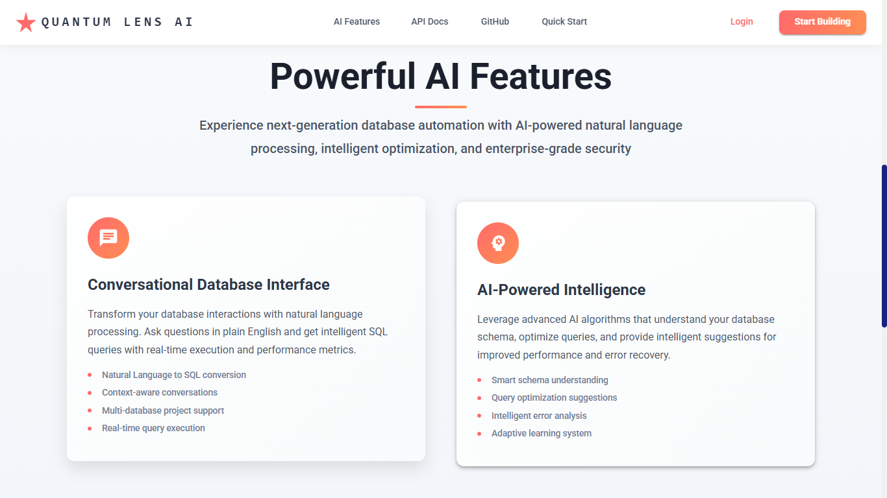

# Quantum Lens SmartSQL Agent

> **Next-Generation AI-Powered Database Intelligence Platform**

Quantum Lens AI is an open-source automation tool I developed, focusing on cutting-edge optimizations and automations in database management. The SmartSQL Agent demonstrates advanced conversational AI interfaces for database interactions, showcasing modern AI/ML technologies and automation capabilities.

[](https://opensource.org/licenses/MIT)
[](https://www.python.org/downloads/)
[](https://reactjs.org/)
[](https://fastapi.tiangolo.com/)

---

## 🚀 **Overview**

Quantum Lens SmartSQL Agent transforms database interaction by enabling natural language queries, intelligent schema understanding, and AI-powered optimization suggestions. This automation tool demonstrates advanced AI/ML implementation and modern full-stack development capabilities.

### **Technical Achievements**
- **AI/ML Integration**: Advanced implementation of language models and conversational AI
- **Modern Architecture**: Full-stack development with FastAPI, React, and microservices
- **Database Automation**: Intelligent automation tools for complex database operations  
- **Production-Ready**: Enterprise-grade security, authentication, and performance optimization

---

## 📸 **Application Screenshots**

### **🎯 Hero Landing Page**
Experience the modern, professional interface that welcomes users to Quantum Lens AI.


### **⚡ Features Overview** 
Discover the powerful AI-driven capabilities and enterprise-grade features.



### **🔐 Secure Authentication**
Clean, professional login interface with enterprise-grade security.


### **📊 Intelligent Dashboard**
Comprehensive project management and database overview dashboard.


### **💬 Conversational AI Interface**
Natural language database interaction with context-aware conversations.


### **🤖 AI-Powered Responses**
Intelligent SQL generation and optimization with detailed explanations.


---

## ✨ **Key Features**

### **🎯 Conversational Database Interface**
- **Natural Language to SQL**: Convert plain English questions into optimized SQL queries
- **Context-Aware Conversations**: Maintains conversation history and database schema context
- **Multi-Database Support**: Connect and switch between multiple database projects seamlessly
- **Real-Time Query Execution**: Instant results with performance metrics

### **🧠 AI-Powered Intelligence**
- **Smart Schema Understanding**: Automatically analyzes database structure and relationships
- **Query Optimization Suggestions**: AI-driven recommendations for performance improvements
- **Error Analysis & Recovery**: Intelligent error detection with human-readable explanations
- **Adaptive Learning**: System learns from query patterns and user preferences

### **🔒 Enterprise-Grade Security**
- **Multi-Tenant Architecture**: Secure project isolation with role-based access control
- **JWT Authentication**: Industry-standard token-based authentication
- **Encrypted Data Storage**: Secure credential management with base64 encryption
- **Audit Logging**: Comprehensive activity tracking and monitoring

### **⚡ Modern Technology Stack**
- **Backend**: FastAPI with async/await support for high performance
- **Frontend**: React  with Material-UI for responsive, modern interface
- **AI Integration**: OpenRouter compatibility with multiple LLM providers
- **Database**: MySQL with connection pooling and optimization
- **Real-Time Communication**: WebSocket support for live collaboration

---

## 🎯 **Automation & Use Cases**

### **Data Analysis Automation**
- **Instant Insights**: "How many records are in my dataset?"
- **Data Exploration**: "What's the distribution of values in this column?"
- **Pattern Discovery**: "Show me trends in this data"

### **Database Management Automation**
- **Schema Analysis**: "What tables are in my database?"
- **Query Generation**: "Generate a complex JOIN query for this requirement"
- **Performance Optimization**: "Explain and optimize this slow query"

### **Intelligent Automation Workflows**
- **Automated Reports**: Generate regular data summaries and insights
- **Data Quality Monitoring**: Identify inconsistencies and missing data automatically
- **Performance Monitoring**: Real-time database health and performance tracking

### **AI-Powered Database Operations**
- **Natural Language Interface**: Convert plain English to optimized SQL queries
- **Conversational Database Access**: Chat-based data interaction and exploration
- **Multi-Model AI Integration**: Seamless integration with various AI service providers

---

## 🛠 **Installation & Setup**

### **Prerequisites**
- Python 3.8 or higher
- Node.js 16 or higher
- MySQL 5.7 or higher
- OpenRouter API account (for AI functionality)

### **Environment Configuration**

Create a `.env` file in the `quantum-lens-backend` directory:

```env
# Database Configuration
DB_HOST=localhost
DB_PORT=3306
DB_USER=root
DB_PASSWORD=your_mysql_password
DB_NAME=quantum_lens

# Authentication
JWT_SECRET=your_super_secure_jwt_secret_key_here
JWT_EXPIRATION=3600

# AI Integration
OPENROUTER_API_KEY=your_openrouter_api_key
SITE_URL=http://localhost:3000
SITE_NAME=Quantum Lens SmartSQL Agent

# Optional: Custom Model Configuration
DEFAULT_MODEL=deepseek/deepseek-chat-v3-0324:free
```

### **Backend Setup**

```bash
# Navigate to backend directory
cd quantum-lens-SmartSQL-Agent/quantum-lens-backend

# Create and activate virtual environment
python -m venv venv
# Windows
venv\Scripts\activate
# macOS/Linux
source venv/bin/activate

# Install dependencies
pip install -r requirements.txt

# Initialize database
python -c "from src.main import app; from src.service.auth.auth_service import AuthService; from src.service.projects.project_service import ProjectService; AuthService.init_db(); ProjectService.init_db()"

# Start the server
uvicorn src.main:app --port 5000 --reload
```

### **Frontend Setup**

```bash
# Navigate to frontend directory
cd quantum-lens-SmartSQL-Agent/quantum-lens-frontend

# Install dependencies
npm install

# Start development server
npm start
```

### **Access the Application**
- **Frontend**: http://localhost:3000
- **Backend API**: http://localhost:5000
- **API Documentation**: http://localhost:5000/docs

---

## 📊 **API Architecture**

### **RESTful Endpoints**

```
Authentication
├── POST /api/v1/auth/register     # User registration
├── POST /api/v1/auth/login        # User authentication
├── GET  /api/v1/auth/me          # Get current user
└── PUT  /api/v1/auth/profile     # Update user profile

Projects
├── POST /api/v1/projects         # Create new project
├── GET  /api/v1/projects         # List user projects
├── GET  /api/v1/projects/{id}    # Get project details
├── PUT  /api/v1/projects/{id}    # Update project
├── DELETE /api/v1/projects/{id}  # Delete project
└── GET  /api/v1/projects/{id}/database-info # Get database schema

SQL Processing
├── POST /api/v1/sql/process      # Natural language to SQL
├── POST /api/v1/sql/execute      # Direct SQL execution
├── POST /api/v1/sql/suggest      # Query suggestions
└── POST /api/v1/sql/explain      # Query explanation

Chat & Collaboration
├── POST /api/v1/chat/completion  # Generate chat responses
├── GET  /api/v1/chat/sessions/{project_id} # Get chat sessions
└── GET  /api/v1/chat/messages/{session_id} # Get chat history
```

---

## 🔮 **Future Roadmap**

### **Phase 1: Enhanced Analytics (Q2 2025)**
- **Interactive Dashboards**: Tableau-style dashboard generation with drag-and-drop interface
- **Automated Insights**: AI-powered data discovery and anomaly detection
- **Data Visualization**: Advanced charting capabilities with exportable formats

### **Phase 2: Business Intelligence (Q3 2025)**
- **PowerPoint Generation**: Automated presentation creation from query results
- **Executive Summaries**: AI-generated business insights and recommendations
- **Scheduled Reports**: Automated report generation and distribution

### **Phase 3: Advanced AI Features (Q4 2025)**
- **Predictive Analytics**: Machine learning models for forecasting and predictions
- **Natural Language Reporting**: Voice-to-insights capabilities
- **Cross-Database Intelligence**: Multi-source data correlation and analysis

### **Phase 4: Enterprise Integration (Q1 2026)**
- **SSO Integration**: Enterprise authentication and authorization
- **Data Governance**: Compliance tools and data lineage tracking
- **Cloud Deployment**: Kubernetes-ready containerization and scaling

---

## 🤝 **Acknowledgments**

We extend our heartfelt gratitude to the following open-source projects and services that make Quantum Lens possible:

### **AI & Language Models**
- **[OpenRouter](https://openrouter.ai/)** - For providing access to cutting-edge language models and enabling our AI-powered query generation
- **DeepSeek** - For their excellent free-tier language models that power our default configuration
- **Anthropic, OpenAI, and other LLM providers** - For advancing the field of AI and making these capabilities accessible

### **Core Technologies**
- **[FastAPI](https://fastapi.tiangolo.com/)** - For the high-performance, modern Python web framework
- **[React](https://reactjs.org/)** - For the powerful frontend framework and ecosystem
- **[Material-UI](https://mui.com/)** - For the beautiful, accessible component library
- **[MySQL](https://www.mysql.com/)** - For reliable, scalable database management

### **Development Tools**
- **[Pandas](https://pandas.pydata.org/)** - For powerful data manipulation and analysis
- **[PyMySQL](https://pymysql.readthedocs.io/)** - For MySQL database connectivity
- **[Framer Motion](https://www.framer.com/motion/)** - For beautiful animations and interactions

---

## 📋 **System Requirements**

### **Minimum Requirements**
- **CPU**: 2 cores, 2.0 GHz
- **RAM**: 4 GB
- **Storage**: 2 GB free space
- **Network**: Stable internet connection for AI services

### **Recommended Requirements**
- **CPU**: 4+ cores, 3.0+ GHz
- **RAM**: 8+ GB
- **Storage**: 10+ GB free space (for logs and cached data)
- **Network**: High-speed internet for optimal AI response times

---

## 🔧 **Development**

### **Project Structure**
```
quantum-lens-SmartSQL-Agent/
├── quantum-lens-backend/          # FastAPI backend application
│   ├── src/
│   │   ├── api/                   # REST API endpoints
│   │   ├── service/               # Business logic layer
│   │   ├── db/                    # Database connectivity
│   │   ├── llm/                   # AI integration
│   │   └── utils/                 # Utility functions
│   └── requirements.txt           # Python dependencies
└── quantum-lens-frontend/         # React frontend application
    ├── src/
    │   ├── components/            # Reusable UI components
    │   ├── pages/                 # Application pages
    │   ├── services/              # API communication
    │   └── context/               # State management
    └── package.json               # Node.js dependencies
```

### **Extending the Automation Tool**
This automation tool is designed to be extensible and customizable:
- Integrate additional AI models and providers
- Add support for more database systems (PostgreSQL, SQLite, Oracle, etc.)
- Build custom automation workflows and plugins
- Enhance the UI with additional features and integrations

---

## 📄 **License**

This project is licensed under the MIT License - see the [LICENSE](LICENSE) file for details.

---

## 🌟 **About This Automation Tool**

This open-source automation tool demonstrates advanced AI/ML implementation and modern full-stack development expertise. Built to showcase cutting-edge technologies including conversational AI, intelligent database automation, and enterprise-grade software architecture. The tool serves as both a practical automation solution and a demonstration of advanced technical capabilities.


*Built with ❤️ as an open-source automation tool* 